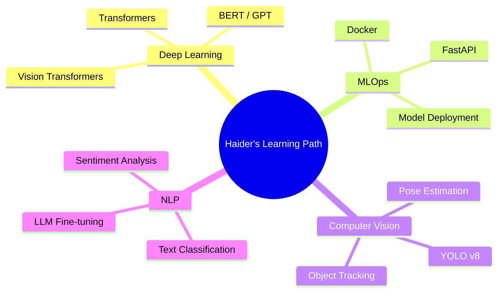

<div align="center">

<!-- Animated Header Banner -->


<!-- Typing Animation -->
[](https://git.io/typing-svg)

<br/>

<!-- Social Badges -->
[](https://github.com/mianhaidersattar420)
[](https://linkedin.com/in/mianhaidersattar)
[](mailto:your-email@gmail.com)
[](https://github.com/mianhaidersattar420)

</div>

---

<!-- About Me -->
## 🧠 `whoami`

```python
#!/usr/bin/env python3
# ============================================================
#   MIAN HAIDER SATTAR  |  AI & ML Engineer  |  Pakistan 🇵🇰
# ============================================================

class MianHaiderSattar:

    def __init__(self):
        self.name        = "Mian Haider Sattar"
        self.username    = "@mianhaidersattar420"
        self.location    = "Pakistan 🇵🇰"
        self.education   = "Computer Science"
        self.passion     = ["Artificial Intelligence", "Machine Learning", "Computer Vision"]

        self.currently   = {
            "learning"   : ["Deep Learning", "NLP", "MLOps"],
            "building"   : "Next-gen AI-powered applications",
            "exploring"  : "Large Language Models & Transformers"
        }

        self.tools       = {
            "languages"  : ["Python", "SQL"],
            "ml_stack"   : ["TensorFlow", "PyTorch", "scikit-learn", "Keras"],
            "data"       : ["Pandas", "NumPy", "Matplotlib", "Seaborn"],
            "cv"         : ["OpenCV", "YOLO", "face_recognition"],
            "dev"        : ["Git", "GitHub", "VS Code", "Jupyter", "Docker"]
        }

        self.fun_fact    = "I teach machines to see, think, and decide 🤖"
        self.goal        = "Democratizing AI — one project at a time 🌍"

    def available_for(self):
        return ["Freelance Projects", "Open Source Collaboration",
                "Research", "Full-time Roles"]

me = MianHaiderSattar()
print(f"👋 Hey! I'm {me.name}")
print(f"🎯 Goal: {me.goal}")
print(f"💡 Fun fact: {me.fun_fact}")
```

---

<!-- Skills Section -->
## ⚡ Tech Arsenal

<div align="center">

### 🐍 Languages


### 🤖 AI / ML / DL


### 📊 Data Science


### 🛠️ Tools & DevOps


</div>

---

<!-- Skill Meters -->
## 📈 Skill Levels

```
🐍  Python             ████████████████░░░░  80% ██ Expert
🤖  Machine Learning   ███████████████░░░░░  75% ██ Advanced
👁️  Computer Vision    ██████████████░░░░░░  70% ██ Advanced
🧮  Deep Learning      █████████████░░░░░░░  65% ██ Intermediate
📊  Data Analysis      ████████████████░░░░  80% ██ Expert
🔍  Fraud Detection    ████████████████░░░░  80% ██ Expert
🗣️  NLP / LLMs         ████████████░░░░░░░░  60% ██ Learning
🐳  MLOps / Docker     ██████████░░░░░░░░░░  50% ██ Learning
```

---

<!-- Projects -->
## 🚀 Featured Projects

<div align="center">

| 🏆 Project | 📝 Description | 🛠️ Stack | ⭐ |
|:---:|:---|:---:|:---:|
| [💳 Credit Card Fraud Detection](https://github.com/mianhaidersattar420/credit_card-_fraud_detection) | ML system to identify fraudulent transactions in real-time and prevent financial loss using anomaly detection & classification algorithms | `Python` `scikit-learn` `Pandas` `ML` | ⭐ |
| [🚪 Face Identification System](https://github.com/mianhaidersattar420/Face-Identification) | AI-powered Smart Door Access Control System using facial recognition to identify authorized users and grant/deny access automatically | `Python` `OpenCV` `Deep Learning` `Jupyter` | ⭐ |
| [🤖 Virtual Assistant](https://github.com/mianhaidersattar420/VIRTUAL_ASSISTANT) | Intelligent virtual assistant powered by AI for task automation and natural language interaction | `Python` `NLP` `AI` | ⭐ |

</div>

### 💳 Credit Card Fraud Detection
> **The Problem:** Financial fraud costs billions annually. **My Solution:** An ML pipeline that catches it before it happens.

```
📦 Architecture
├── 🔄 Data Preprocessing    →  Handle imbalanced datasets (SMOTE)
├── 🔍 Feature Engineering   →  Extract fraud patterns from transactions
├── 🧠 Model Training        →  Random Forest + XGBoost ensemble
├── 📊 Evaluation            →  Precision, Recall, F1, ROC-AUC
└── 🛡️ Deployment Ready      →  Real-time scoring API
```

### 🚪 Face Identification System
> **Smart access control** — no keys, no cards, just your face.

```
📦 Pipeline
├── 📷 Camera Input          →  Real-time video stream
├── 🔎 Face Detection        →  Haar Cascades / MTCNN
├── 🧬 Feature Extraction    →  128-d face embeddings
├── 🔐 Identity Matching     →  Cosine similarity threshold
└── ✅ Access Control        →  Grant / Deny with logging
```

---

<!-- GitHub Stats -->
## 📊 GitHub Analytics

<div align="center">


</div>

<div align="center">

[](https://git.io/streak-stats)

</div>

<!-- Activity Graph -->
<div align="center">

[](https://github.com/ashutosh00710/github-readme-activity-graph)

</div>

---

<!-- Trophies -->
## 🏆 GitHub Trophies

<div align="center">

[](https://github.com/ryo-ma/github-profile-trophy)

</div>

---

<!-- Currently Learning -->
## 🌱 Currently Learning

<div align="center">



</div>

---

<!-- Roadmap -->
## 🗺️ 2025–2026 Roadmap

```
✅  Credit Card Fraud Detection System          [COMPLETED]
✅  Face Recognition Access Control             [COMPLETED]
✅  Virtual Assistant                           [COMPLETED]
🔄  Deploy ML Models as REST APIs              [IN PROGRESS]
🔄  Kaggle Competitions                        [IN PROGRESS]
📋  LLM Fine-tuning Project                    [PLANNED]
📋  Real-time Object Detection App             [PLANNED]
📋  End-to-end MLOps Pipeline                  [PLANNED]
📋  AI SaaS Product Launch                     [DREAM 🌟]
```

---

<!-- Fun Facts -->
## ⚡ Fun Facts & Random

```python
fun_facts = [
    "🤖 I've trained models that are smarter than me at spotting fraud",
    "👁️ My face recognition system never forgets a face (unlike me 😅)",
    "☕ Coffee → Code → Model → Repeat is my daily loop",
    "🌙 Best debugging happens at 2 AM (don't ask why)",
    "📚 I read ML papers for fun on weekends",
    "🎯 Currently obsessed with making AI accessible to everyone",
]

import random
print(random.choice(fun_facts))
```

---

<!-- Quote -->
## 💭 Dev Quote of the Day

<div align="center">

[](https://github.com/piyushsuthar/github-readme-quotes)

</div>

---

<!-- Snake Animation -->
## 🐍 Contribution Snake

<div align="center">

<picture>
  <source media="(prefers-color-scheme: dark)" srcset="https://raw.githubusercontent.com/mianhaidersattar420/mianhaidersattar420/output/github-contribution-grid-snake-dark.svg">
  <source media="(prefers-color-scheme: light)" srcset="https://raw.githubusercontent.com/mianhaidersattar420/mianhaidersattar420/output/github-contribution-grid-snake.svg">
  
</picture>

</div>

---

<!-- Connect -->
## 🤝 Let's Connect & Collaborate

<div align="center">

> 💡 *I'm always open to interesting projects, research collaborations, and new opportunities!*

[](https://github.com/mianhaidersattar420)
[](https://linkedin.com/in/mianhaidersattar)
[](mailto:your-email@gmail.com)
[](https://kaggle.com/mianhaidersattar)

<br/>

**Open to:** `Freelance` • `Open Source` • `Research` • `Full-time Roles` • `Mentorship`

</div>

---

<!-- Footer -->
<div align="center">


**⭐ Star my repos if you find them useful! It motivates me to build more.**

`Made with ❤️ by Mian Haider Sattar` • `Pakistan 🇵🇰` • `2025`


</div>
